# ResilientWorkerKit

**Keep writing plain `BackgroundService` jobs — stop rewriting scheduling, retry, checkpointing, idempotency and health tracking in every project.**

[](https://github.com/mFurkanHiz/ResilientWorkerKit/actions/workflows/ci.yml)
[](LICENSE)
[](https://dotnet.microsoft.com/download/dotnet/10.0)
[](#tests)
[](#tests)

ResilientWorkerKit is a lightweight reliability and execution layer for background jobs hosted in
a .NET Generic Host. You write the business logic; the kit owns the loop, the failure boundary,
the retry policy, the durable checkpoint, the idempotency gate and the execution history.

```csharp
public sealed class ReservationSyncJob(IReservationApiClient api, ReservationLedger ledger) : IWorkerJob
{
    public async Task ExecuteAsync(JobExecutionContext context, CancellationToken cancellationToken)
    {
        var checkpoint = await context.Checkpoints.GetAsync<SyncCheckpoint>(cancellationToken);
        var page = await api.GetReservationsAsync(checkpoint?.ContinuationToken, cancellationToken);

        foreach (var reservation in page.Items)
        {
            var key = $"reservation:{reservation.Id}:v{reservation.Version}";
            if (await context.Idempotency.TryAcquireAsync(key, cancellationToken) != IdempotencyAcquireResult.Acquired)
            {
                continue; // already processed — no second side effect
            }

            ledger.Reconcile(reservation);
            await context.Idempotency.MarkCompletedAsync(key, cancellationToken);
        }

        // Only after the whole page succeeded:
        await context.Checkpoints.SaveAsync(new SyncCheckpoint(page.NextContinuationToken), cancellationToken);
    }
}
```

```csharp
services.AddResilientWorkerKit(kit =>
{
    kit.UseEntityFrameworkCore(db => db.UseSqlite(connectionString));

    kit.AddJob<ReservationSyncJob>("reservation-sync", job => job
        .WithInterval(TimeSpan.FromMinutes(5))
        .RunOnStartup()
        .WithTimeout(TimeSpan.FromMinutes(2))
        .PreventOverlappingExecutions()
        .WithRetryCount(3));
});
```

---

## The problem

A plain `BackgroundService` looks harmless:

```csharp
while (!stoppingToken.IsCancellationRequested)
{
    await DoWorkAsync(stoppingToken);
    await Task.Delay(TimeSpan.FromMinutes(5), stoppingToken);
}
```

…until production happens:

| What goes wrong | What it costs |
|---|---|
| `DoWorkAsync` throws | The exception escapes `ExecuteAsync`; the **whole host stops**. One transient blip becomes an outage until someone restarts the process. |
| A `continue` skips the delay | A 100% CPU busy loop hammering an upstream API thousands of times per second. |
| No retry | A one-second network hiccup loses an entire cycle of work. |
| No durable progress | A crash mid-batch restarts blind: reprocess everything, or lose it. |
| No idempotency | Every retry and every restart creates duplicate records, duplicate emails, duplicate charges. |
| No overlap guard | A slow run overlaps its successor; both process the same rows. |
| Wall-clock scheduling | DST transitions skip a day — or fire twice. |
| `catch { log.LogInformation(ex.Message); }` | Days of failures invisible to alerting, stack traces gone. |
| Shutdown mid-item | The stop signal lands between an external write and the local status flip — the exact window that produces duplicates on restart. |

Every row above came out of a [clean-room analysis of real worker fleets](docs/problem-analysis.md);
every one of them is addressed by a specific feature below.

## What ResilientWorkerKit does

- **Failure isolation by construction.** A job exception cannot reach the host. It is caught at
  the execution boundary, classified, recorded and logged with its stack trace — and the scheduler
  loop, the other jobs and the host keep running.
- **Retry that understands failures.** Transient/permanent/cancelled/timed-out/abandoned/misconfigured
  classification, exponential backoff with jitter, `Retry-After` support, attempt and total timeouts.
  The `ExecutionId` is stable across attempts, so history reads as one execution with N attempts.
- **Durable checkpoints and real resume.** Save progress after each successful batch; after a crash
  the next execution continues from there instead of starting over.
- **Idempotency with an atomic gate.** Concurrent acquisitions of the same key are settled by the
  database (composite primary key + concurrency token), not by a hopeful `if (!exists)`.
- **Ten schedule types, one host.** Interval, fixed delay, cron, daily, weekly, monthly (with
  explicit short-month policies), last-day-of-month, one-time, explicit planned times,
  run-on-startup — each with its own time zone, timeout, retry, misfire and overlap policy.
- **Planned actions that eventually happen.** Schedule a sale opening for 15 August at 10:00, and
  if it fails, have it retried five minutes later — *durably*, so the retry survives a deployment
  in between. In-memory retry cannot promise that; a queued follow-up can.
- **Restart-safe calendar identity.** A monthly occurrence carries the identity
  `monthly-billing:2026-08`; once it has completed, no restart, misfire recovery or DST quirk can
  run it a second time.
- **Graceful shutdown.** Running jobs get the cancellation token, a configurable grace period, and
  a `Cancelled` status logged at Information — a clean stop is not an error. Nothing half-finished
  is ever marked successful.
- **Observability that works out of the box.** Structured logs with correlation scopes,
  `System.Diagnostics.Metrics` counters/histograms, `ActivitySource` tracing, and per-job health
  checks with stuck detection.

## What it is not

Not Hangfire (no dashboard, no fire-and-forget job queue). Not Quartz (no clustering, no scheduler
platform). Not Temporal or Durable Task (no distributed workflow orchestration). Not a message
queue. See [docs/scope.md](docs/scope.md) and [docs/limitations.md](docs/limitations.md).

**It does not claim exactly-once execution.** The contract is *at-least-once execution + durable
checkpoints + idempotent processing*, which is what an honest single-process system can guarantee
when it talks to external APIs. See [docs/execution-semantics.md](docs/execution-semantics.md).

## Architecture

```mermaid
graph TD
    A[ResilientWorkerKit.Abstractions] --> B[ResilientWorkerKit]
    B --> C[ResilientWorkerKit.EntityFrameworkCore]
    B --> D[ResilientWorkerKit.HealthChecks]
    A --> E[ResilientWorkerKit.Http]
```



One hosted service owns an independent scheduler loop per job:

```
WorkerKitHostedService
 ├─ startup recovery: stale Running executions → Abandoned
 ├─ JobScheduleLoop "reservation-sync"  ─┐
 ├─ JobScheduleLoop "notification-…"    ─┼─ each: occurrence → misfire policy → overlap policy
 ├─ JobScheduleLoop "monthly-billing"   ─┘        → JobRunner (DI scope, retry, timeouts,
 └─ graceful shutdown drain                          history, dead letters, metrics)
```

Details in [docs/architecture.md](docs/architecture.md).

## Getting started

> **Not on NuGet yet.** Each release publishes source plus CI-equivalent package artifacts.
> Clone the repository, or reference the projects directly:
>
> ```bash
> git clone https://github.com/mFurkanHiz/ResilientWorkerKit.git
> dotnet add YourApp reference ResilientWorkerKit/src/ResilientWorkerKit/ResilientWorkerKit.csproj
> ```
>
> `dotnet pack` produces all five packages if you prefer a local feed. See
> [docs/roadmap.md](docs/roadmap.md) for the publication plan.

```csharp
using ResilientWorkerKit;

var builder = Host.CreateApplicationBuilder(args);

builder.Services.AddResilientWorkerKit(kit =>
{
    kit.AddJob<CleanupJob>("cleanup", job => job.WithInterval(TimeSpan.FromMinutes(10)));
});

await builder.Build().RunAsync();
```

That is the whole setup. In-memory stores are registered by default so you can start immediately;
add `kit.UseEntityFrameworkCore(...)` when you want the state to survive a restart.

### Multiple jobs, multiple schedules

```csharp
services.AddResilientWorkerKit(kit =>
{
    kit.UseEntityFrameworkCore(db => db.UseSqlite(connectionString));

    kit.AddJob<ReservationSyncJob>("reservation-sync", job => job
        .WithInterval(TimeSpan.FromMinutes(5))
        .RunOnStartup()
        .PreventOverlappingExecutions());

    kit.AddJob<NotificationDispatchJob>("notification-dispatch", job => job
        .WithFixedDelay(TimeSpan.FromMinutes(1))
        .WithTimeout(TimeSpan.FromSeconds(45)));

    kit.AddJob<DailyReconciliationJob>("daily-reconciliation", job => job
        .DailyAt(new TimeOnly(2, 0), "Europe/Istanbul"));

    kit.AddJob<WeeklyCleanupJob>("weekly-cleanup", job => job
        .WeeklyAt([DayOfWeek.Sunday], new TimeOnly(3, 0), "Europe/Istanbul"));

    kit.AddJob<MonthlyBillingJob>("monthly-billing", job => job
        .MonthlyOnDay(5, new TimeOnly(10, 30), "Europe/Istanbul", MonthlyInvalidDayPolicy.SkipMonth)
        .WithMisfirePolicy(MisfirePolicy.RunImmediatelyOnce)
        .WithTimeout(TimeSpan.FromMinutes(30)));

    kit.AddJob<EndOfMonthSettlementJob>("end-of-month-settlement", job => job
        .OnLastDayOfMonth(new TimeOnly(23, 0), "Europe/Istanbul"));
});
```

If `reservation-sync` starts failing every run, the other five keep their schedules exactly.

### A planned action that must eventually happen

```csharp
kit.AddJob<OpenTicketSaleJob>("ticket-sale-open", job => job
    // 10:00 Istanbul on 15 August — and again on the 16th
    .AtLocalTimes("Europe/Istanbul",
        new DateTime(2026, 8, 15, 10, 0, 0),
        new DateTime(2026, 8, 16, 10, 0, 0))

    // Fast, in-memory: ride out a momentary upstream hiccup
    .WithRetry(r => { r.MaxRetries = 2; r.BaseDelay = TimeSpan.FromSeconds(5); })

    // Slow, durable: if it still failed, try again every 5 minutes, up to 3 times —
    // and keep that promise across a restart
    .RetryLater(maxAttempts: 3, delay: TimeSpan.FromMinutes(5)));
```

`WithRetry` retries *inside* one execution: seconds, in memory, lost if the process restarts.
`RetryLater` queues a *new* execution in a durable store, so a redeploy during the waiting window
does not lose it. Use `Repeating(startAt, every, count)` for "three times on the 15th, four hours
apart". [docs/failure-handling.md](docs/failure-handling.md#retry-now-vs-retry-later)

### Checkpoint and resume

```csharp
public sealed record SyncCheckpoint(string? ContinuationToken, int PagesProcessed);

var checkpoint = await context.Checkpoints.GetAsync<SyncCheckpoint>(cancellationToken)
    ?? new SyncCheckpoint(null, 0);

// ... process the page, commit local changes ...

await context.Checkpoints.SaveAsync(
    new SyncCheckpoint(page.NextContinuationToken, checkpoint.PagesProcessed + 1),
    cancellationToken);
```

A failed batch never advances the checkpoint, so the next execution retries exactly the work that
did not finish. [docs/checkpoints.md](docs/checkpoints.md)

### API integration

```csharp
services.AddResilientApiClient<IReservationApiClient, ReservationApiClient>("reservations", o =>
{
    o.BaseAddress = new Uri(configuration["ReservationApi:BaseUrl"]!);
    o.AttemptTimeout = TimeSpan.FromSeconds(10);
    o.EnableIdempotencyKey = true;   // Idempotency-Key on POST/PUT/PATCH, stable across retries
    o.ApiKeyHeaderName = "X-Api-Key"; // value comes from IApiKeyProvider, never from source
});
```

Pooled clients, mandatory timeouts, retry with `Retry-After`, circuit breaker, correlation IDs,
pagination helpers, and logging that records method/host/path/status/duration — never bodies,
query strings or credentials. [docs/api-integration.md](docs/api-integration.md)

### Health checks

```csharp
services.AddHealthChecks().AddResilientWorkerKit();
app.MapHealthChecks("/health");
```

A job that has never run is Healthy (deploying a new job should not page anyone); consecutive
failures degrade it; sustained failure or a stuck execution escalates.
[docs/health-checks.md](docs/health-checks.md)

## FAQ

<details>
<summary><b>What happens when a job throws?</b></summary>

The exception is caught at the execution boundary, classified, and the execution is recorded as
`Failed` with the full stack trace logged at Error level. If the failure is transient and retries
remain, the kit retries with backoff. **The host does not stop, the scheduler loop does not stop,
and no other job is affected.** At the next scheduled occurrence, the job runs again.
</details>

<details>
<summary><b>How does the kit resume after a restart?</b></summary>

Your job writes a checkpoint after each fully successful batch. On the next execution — including
the first one after a crash — `context.Checkpoints.GetAsync<T>()` returns exactly that state.
Items that were already processed are additionally protected by their idempotency records, so a
partially-processed batch replays without duplicating side effects.
</details>

<details>
<summary><b>Why do I need idempotency if I have checkpoints?</b></summary>

Because there is no distributed transaction between "call the external API" and "record that we
called it". A crash in that gap means the item comes back. The checkpoint tells you *where* to
resume; the idempotency record tells you *which items in that range are already done*.
</details>

<details>
<summary><b>How is the 31st handled in February?</b></summary>

Explicitly, by your choice: `SkipMonth` (no run in short months),
`RunOnLastAvailableDay` (runs Feb 28, or Feb 29 in leap years), or `FailConfiguration` (the
ambiguity is rejected at startup so nobody discovers it in production).
[docs/monthly-scheduling.md](docs/monthly-scheduling.md)
</details>

<details>
<summary><b>What if the host was down when a job was due?</b></summary>

The misfire policy decides: `Skip` (wait for the next occurrence — the default for calendar
schedules), `RunImmediatelyOnce` (run the missed occurrence once, restart-safe),
`RunIfWithinTolerance` (only if it is not too late), or `RescheduleFromNow` (interval/fixed-delay
only). A missed occurrence is never created twice, even if the host restarts repeatedly.
</details>

<details>
<summary><b>Can I swap the persistence provider?</b></summary>

Yes — five interfaces (`IJobCheckpointStore`, `IJobExecutionStore`, `IIdempotencyStore`,
`IDeadLetterStore`, `IJobLockProvider`). Register your own implementation instead of calling
`UseEntityFrameworkCore`. [docs/persistence.md](docs/persistence.md)
</details>

<details>
<summary><b>How is this different from Hangfire or Quartz?</b></summary>

| | ResilientWorkerKit | Hangfire | Quartz.NET |
|---|---|---|---|
| Primary model | Scheduled jobs you write as classes in your host | Enqueued background jobs with a dashboard | Full scheduler platform |
| Checkpoint/resume | Built in, first-class | Not a concept | Not a concept |
| Idempotency store | Built in | Not a concept | Not a concept |
| Dashboard | No (Phase 2) | Yes | Third-party |
| Clustering | No (single active instance in v1) | Yes | Yes |
| Footprint | Small library, five interfaces | Larger platform | Larger platform |

Use Hangfire when you need a dashboard and enqueued fire-and-forget jobs. Use Quartz when you need
clustering and a full scheduler platform. Use this when you already have a Worker Service, your
jobs are polling/sync/reconciliation loops, and what you actually lack is reliability plumbing.
</details>

## Samples

| Sample | Shows |
|---|---|
| [`samples/MultiJob.Worker`](samples/MultiJob.Worker) | Six jobs, six schedule types, one host; a deliberately flaky job retrying while a heartbeat job keeps succeeding |
| [`samples/ReservationReconciliation.Worker`](samples/ReservationReconciliation.Worker) | The full stack: SQLite persistence, an embedded fake API that scripts 500s, a 429 with `Retry-After`, an invalid record and a duplicate record; checkpoint resume, dead-lettering, health endpoint |

```bash
dotnet run --project samples/ReservationReconciliation.Worker
```

Then open `http://localhost:5210/` for per-job health snapshots and `/health` for the health check.
Run it twice: the second run reports `ledgerSideEffects: 0` because every reservation's idempotency
record survived in SQLite. Details in the [sample README](samples/ReservationReconciliation.Worker/README.md).

## Tests

```bash
dotnet test
```

| Suite | Count | Scope |
|---|---|---|
| Unit | 205 | Schedule math (DST gaps, ambiguous hours, leap years, invalid-day policies), retry backoff and jitter bounds, failure classification, runner execution/retry/checkpoint/idempotency, misfire and overlap policies, manual triggers, graceful shutdown, in-memory stores, health evaluation, HTTP handlers and masking, registration validation |
| Integration | 16 | Real Generic Host, real DI scopes, real SQLite file database that survives restarts, real HTTP server: the end-to-end failure→restart→resume scenario, `Retry-After` and permanent-400 handling, abandoned-execution recovery, monthly identity across restarts, the EF Core idempotency race, health checks through the real pipeline |

Both suites run against **both target frameworks** — 442 test executions per CI leg, on Linux and
Windows. A supported target framework that never executes a test is a claim, not a guarantee.

Schedule and engine tests run on `FakeTimeProvider`, so a month of scheduling is verified in
milliseconds — the whole suite finishes in about ten seconds.

Measured coverage across the five library assemblies, as reported by CI on the last run
(coverlet, Release build): **86.1% lines, 79% branches, 94.1% methods**. The uncovered remainder
is mostly log-message plumbing and defensive store-failure paths. The full HTML report is
published as a CI artifact on every run.

Both the Linux and Windows legs run the whole suite, which is how the write-ordering issue in
`JobRunner` was caught: it only reproduced on the slower Windows runner.

## Documentation

| | |
|---|---|
| [problem-analysis.md](docs/problem-analysis.md) | The observed failure patterns this library exists to remove |
| [architecture.md](docs/architecture.md) | Layers, components, execution and scheduler lifecycles |
| [scope.md](docs/scope.md) | MVP, non-goals, Phase 2 |
| [public-api.md](docs/public-api.md) | Job API, registration API, store API, extension points |
| [execution-semantics.md](docs/execution-semantics.md) | At-least-once, identities, states, the exactly-once limitation |
| [scheduling.md](docs/scheduling.md) | Every schedule type, time zones, misfire, overlap |
| [monthly-scheduling.md](docs/monthly-scheduling.md) | Day-of-month, short months, leap years, restart behavior |
| [checkpoints.md](docs/checkpoints.md) | Checkpoint shapes, atomicity, the transaction boundary |
| [idempotency.md](docs/idempotency.md) | Keys, races, record lifecycle, security |
| [failure-handling.md](docs/failure-handling.md) | Classification, retry, timeouts, cancellation, dead letters |
| [api-integration.md](docs/api-integration.md) | Typed clients, auth, resilience, pagination, masking |
| [persistence.md](docs/persistence.md) | In-memory, EF Core, SQLite, SQL Server, migrations |
| [observability.md](docs/observability.md) | Logs, metrics, traces, cardinality rules |
| [health-checks.md](docs/health-checks.md) | Status computation, thresholds, stuck detection |
| [security.md](docs/security.md) | Secrets, logs, checkpoints, dead letters, packaging |
| [testing.md](docs/testing.md) | How the kit is tested and how to test your own jobs |
| [limitations.md](docs/limitations.md) | What this does not do |
| [roadmap.md](docs/roadmap.md) | Distributed locks, admin API, dashboard, NuGet publication |

## Design decisions worth explaining

A few choices here were not the obvious ones. The reasoning matters more than the code:

**At-least-once instead of a bigger promise.** Exactly-once across an external API call and a
local database needs both sides in one protocol. Rather than pretend, the kit states the real
contract and ships the two primitives that make it safe in practice — checkpoints and an atomic
idempotency gate. A library that over-promises here fails silently in production; one that is
explicit lets you design around it.

**One hosted service with a loop per job, not one `BackgroundService` per job.** A single owner
makes graceful shutdown, startup recovery and host-wide invariants tractable, while each job
still gets an independent async loop. The isolation guarantee is enforced at two boundaries
(runner and loop), so it holds even if one of them has a bug.

**Occurrence identity instead of "did we run recently?".** A monthly job carries the identity
`monthly-billing:2026-08`. Duplicate suppression asks whether that identity *completed*; misfire
recovery asks whether *any record exists*. That asymmetry is deliberate: the first prevents
double-billing, the second prevents a restart loop from re-creating the same missed run. Getting
this wrong is how monthly jobs fire twice.

**`TimeProvider` everywhere, no `DateTime.Now`.** Schedules are pure functions of their inputs,
so DST gaps, ambiguous fall-back hours, leap years and 31st-of-February cases are ordinary table
tests. A year of scheduling is verified in milliseconds, which is why the edge cases are actually
covered rather than hoped about.

**Metrics via BCL primitives, no OpenTelemetry package.** `Meter` and `ActivitySource` are already
the integration point. Shipping an adapter package would have added a dependency and a version
matrix to solve a problem that does not exist.

**The failure classifier defaults unknown exceptions to transient.** An unnecessary retry costs a
few attempts; skipping a necessary one loses work. Deterministic failures are expected to say so
via `PermanentJobException` — the type system carries the intent instead of a heuristic guessing it.

**Documentation written against the source, not from memory.** Doing that pass caught nine real
defects — including exception messages being persisted unmasked, `MaxDelay` not actually being a
maximum once jitter was applied, and a health rule that could never fire for a job that had never
succeeded. They are fixed, and the process is why [docs/](docs) matches behavior.

## Known limitations

- **No exactly-once execution.** At-least-once + checkpoints + idempotency, by design.
- **Single active host instance.** v1 locking is in-process; running two instances against one
  database can double-execute. Distributed locking is the top Phase 2 item.
- **No dashboard or admin API.** A manual-trigger extension point (`IManualJobTrigger`) exists;
  the HTTP surface around it does not.
- **Job definitions live in code**, not in the database — no runtime registration.
- **Not a workflow engine.** No inter-job dependencies, fan-out/fan-in or compensation.

## Requirements

Multi-targets **`net10.0` and `net8.0`**, the two LTS releases currently in support.

A `net8.0`-only library would technically run on a .NET 10 host, but it would drag .NET 8 versions
of `Microsoft.Extensions.*` into a .NET 10 application. Targeting both means each consumer gets
framework-matched dependencies. The `net8.0` leg exists because .NET 8 remains supported until
November 2026; it will be dropped in a later major version once that window closes.

## License

MIT — see [LICENSE](LICENSE).
