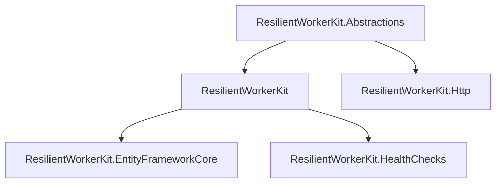
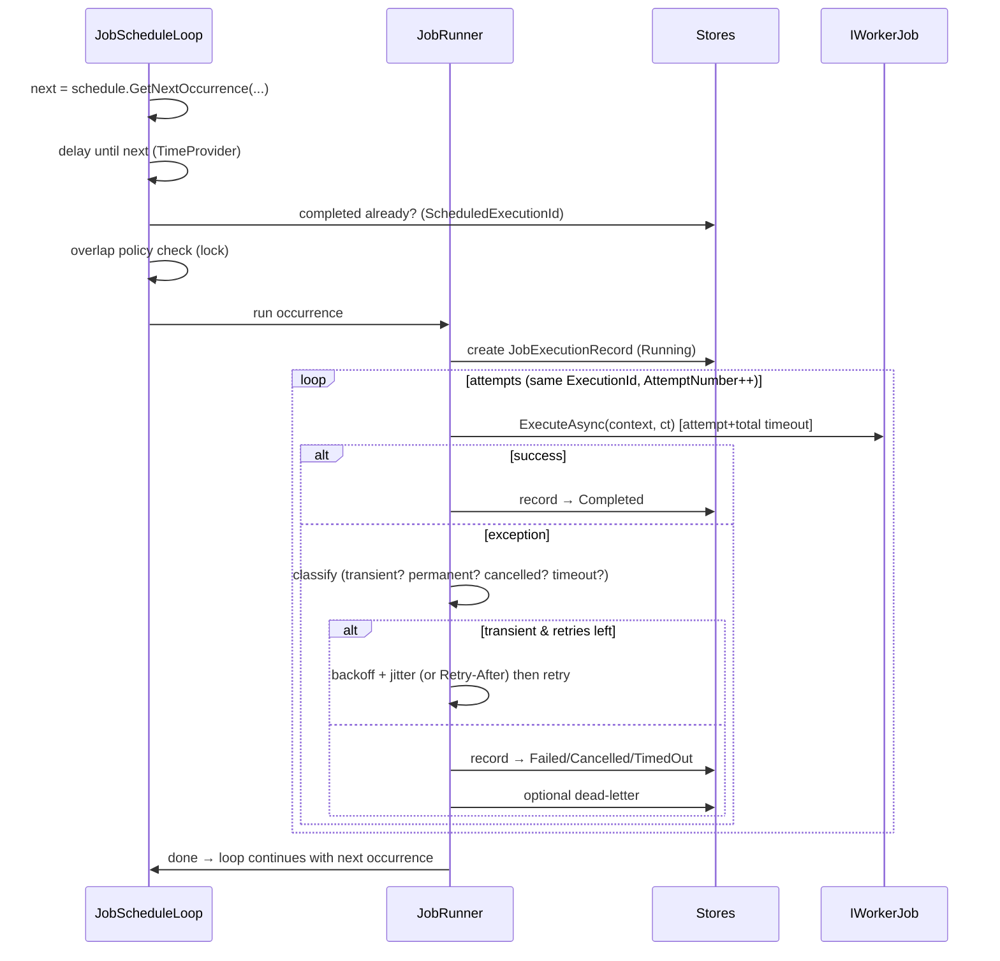

# Architecture

## Packages and layering



| Package | Responsibility | Key dependencies |
|---|---|---|
| `ResilientWorkerKit.Abstractions` | Contracts and models only: `IWorkerJob`, `JobExecutionContext` surface, store interfaces, schedule interface, failure classification, health snapshot | `Microsoft.Extensions.Logging.Abstractions` |
| `ResilientWorkerKit` | The engine: registration API, scheduler loops, job runner (retry/timeout/isolation), schedule implementations, in-memory stores, in-process lock, metrics/tracing, health tracking | `Cronos`, `Microsoft.Extensions.Hosting.Abstractions`, `Microsoft.Extensions.Options` |
| `ResilientWorkerKit.EntityFrameworkCore` | Durable stores over EF Core (SQLite, SQL Server, any relational provider) | `Microsoft.EntityFrameworkCore` |
| `ResilientWorkerKit.Http` | Typed HttpClient integration: resilience pipeline, auth/correlation/idempotency handlers, masked logging, pagination | `Microsoft.Extensions.Http.Resilience` |
| `ResilientWorkerKit.HealthChecks` | `IHealthCheck` adapter over the health tracker | `Microsoft.Extensions.Diagnostics.HealthChecks` |

Design principles applied:

- **Dependency inversion** — the engine only talks to store/lock/classifier interfaces from
  `Abstractions`; persistence and HTTP are replaceable without touching the engine.
- **Small public API** — jobs implement one interface; everything else is optional configuration.
- **No package for its own sake** — metrics/tracing use the BCL (`Meter`, `ActivitySource`), so no
  OpenTelemetry adapter package is needed; a scheduling package was folded into the core because
  schedules are pure functions with no extra dependencies except Cronos.

## Components (core package)

```
AddResilientWorkerKit(...)          registration + validation
 └─ WorkerKitBuilder / JobBuilder   fluent, strongly-typed job configuration
JobRegistry                         immutable set of JobDefinitions (validated at startup)
WorkerKitHostedService              the single BackgroundService that owns everything
 ├─ JobScheduleLoop (per job)       computes occurrences, applies misfire & overlap policies
 │   └─ JobRunner                   one execution: DI scope, context, retry loop, timeouts,
 │                                  classification, execution record, dead-letter, metrics
 ├─ StartupRecovery                 marks stale Running executions as Abandoned
 └─ GracefulShutdown                stops loops, waits for the grace period, finalizes records
JobHealthTracker                    in-memory per-job health snapshot (feeds health checks)
WorkerKitMetrics / ActivitySource   low-cardinality metrics + per-execution tracing
Stores (in-memory defaults)         checkpoint / execution / idempotency / dead-letter
InProcessJobLockProvider            per-job non-overlap lock
```

### Why one hosted service with per-job loops (not one BackgroundService per job)?

- A single owner makes graceful shutdown, startup recovery and host-wide invariants trivial.
- Each job still gets an **independent async loop**; one loop crashing (which itself is prevented
  by a last-resort catch) can never take down another loop or the host.
- Loops are lightweight `Task`s awaiting `TimeProvider`-based delays — no threads are blocked.

## Execution lifecycle



Key invariants:

1. **The host never dies because of a job.** `JobRunner` catches everything at the execution
   boundary; the loop catches everything at the scheduling boundary (defense in depth). Unhandled
   exceptions are impossible to leak into `WorkerKitHostedService.ExecuteAsync`.
2. **`OperationCanceledException` is interpreted, not swallowed.** Cancellation caused by host
   shutdown produces `Cancelled` (Information log); cancellation caused by an attempt/total
   timeout produces `TimedOut`; anything else is classified.
3. **Checkpoints only move forward on success.** The engine never writes checkpoints itself;
   the job writes them via `context.Checkpoints` *after* a batch truly succeeded, and a failed
   attempt cannot advance them retroactively.
4. **ExecutionId is stable across retries** — attempt number increments; a new occurrence gets a
   new ExecutionId and a new ScheduledExecutionId.

## Scheduler lifecycle

Per job:

1. **Startup** — read the latest execution record (if any) to recover `LastScheduledAtUtc` /
   `LastCompletedAtUtc`; run startup recovery (`Running` → `Abandoned`).
2. **Run-on-startup** — if configured, run one immediate occurrence (identity `startup:<host-start>`).
3. **Misfire check** — if the next occurrence computed from recovered state lies in the past,
   apply the job's misfire policy. A recovered occurrence is only created if **no execution record
   with the same `ScheduledExecutionId` exists** (this is what makes misfire recovery restart-safe).
4. **Steady state** — compute next occurrence → delay → duplicate check → overlap policy → run →
   record state → repeat.
5. **Shutdown** — stop starting new occurrences immediately; signal `CancellationToken` to running
   jobs; wait up to `ShutdownGracePeriod`; running executions that finish are recorded normally,
   ones that do not are recorded `Cancelled` (cooperative) and the process exits without them being
   marked successful.

Time is always obtained from `TimeProvider` (never `DateTime.Now`/`UtcNow` directly), so every
schedule computation and delay is testable with `FakeTimeProvider`.

## Data flow for durable state

- `IJobCheckpointStore` — one JSON payload per job (typed via `context.Checkpoints.Get/SaveAsync<T>`).
- `IJobExecutionStore` — append/update execution records; also answers "has this
  ScheduledExecutionId already completed?" (monthly identity, one-time jobs, DST double-fire guard).
- `IIdempotencyStore` — keyed records with `Pending/Completed/Failed` status + expiry;
  `TryAcquire` is the atomic gate that makes concurrent duplicates lose.
- `IDeadLetterStore` — item-level (from job code) and execution-level (on retry exhaustion, opt-in)
  records with masked payload summaries.

All four have in-memory implementations (single process, test/demo) and EF Core implementations
(durable, relational). The EF Core idempotency race is settled by a **unique index** on
`(JobId, IdempotencyKey)` — the second concurrent insert loses at the database, not in C#.
